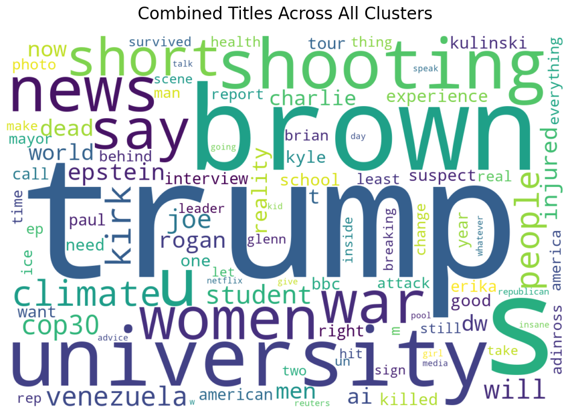

# YouTube Vibes Tracker

Track and analyze content patterns across YouTube channels over time.

## What It Does

This tool helps you monitor what different groups of YouTube channels are talking about. You define "clusters" of channels (e.g., left-leaning news, right-leaning news, tech channels), and the tool:

1. Fetches recent videos from those channels
2. Analyzes the transcripts to extract themes, sentiment, and framing
3. Tracks how these narratives evolve over time
4. Compares what different clusters are focusing on

Useful for research on media ecosystems, narrative analysis, or just understanding what your favorite YouTube niches are up to.



## Features

- **Automated data collection** from YouTube channels (quota-optimized)
- **AI-powered analysis** using Google's Gemini to extract themes, sentiment, and framing
- **Temporal tracking** - see how topics evolve over weeks, months, or years
- **Cross-cluster comparison** - identify consensus topics vs echo chambers
- **25+ visualizations** including word clouds, heatmaps, and trend charts
- **Multi-year analysis** - can collect years of historical data efficiently
- **Incremental processing** - only processes new videos on subsequent runs (100x faster)
- **Parallel processing** - analyze multiple videos concurrently (3-5x faster)
- **Caching** - never re-fetch transcripts or re-analyze the same video

## Quick Start

### Installation

```bash
# Clone the repo
git clone https://github.com/YOUR_USERNAME/vibes-tracker.git
cd vibes-tracker

# Set up virtual environment
python3 -m venv .venv
source .venv/bin/activate  # On Windows: .venv\Scripts\activate

# Install dependencies
pip install -r requirements.txt
```

### API Keys

Create a `.env` file in the project root:

```
YOUTUBE_API_KEY=your_youtube_api_key
GEMINI_API_KEY=your_gemini_api_key
```

Get your API keys:
- YouTube: [Google Cloud Console](https://console.cloud.google.com/) → Enable YouTube Data API v3
- Gemini: [Google AI Studio](https://aistudio.google.com/app/apikey)

### Configure Your Channels

Edit `config/clusters.json` to define your channel groups:

```json
{
  "tech": ["@mkbhd", "@linustechtips", "@verge"],
  "news": ["@cnn", "@foxnews", "@bbcnews"],
  "finance": ["@bloomberg", "@cnbc", "@wallstreetjournal"]
}
```

### Run the Pipeline

```bash
# Full pipeline: fetch data → analyze → visualize
python src/main.py pipeline

# Or run stages individually
python src/main.py ingest     # Fetch video metadata
python src/main.py analyze    # Run AI analysis
python src/main.py visualize  # Generate plots
```

Check `figures/` for your visualizations and `data/analyzed_data.csv` for the results.

## Usage

### Basic Commands

```bash
# Fetch video metadata from YouTube
python src/main.py ingest

# Analyze transcripts with Gemini
python src/main.py analyze

# Generate all visualizations
python src/main.py visualize

# Run temporal trend analysis
python src/main.py temporal --days-back 30

# Compare clusters
python src/main.py compare

# Run complete pipeline
python src/main.py pipeline
```

### Incremental Mode (Recommended for Daily Use)

After the first run, use incremental mode to only process new videos:

```bash
# Only fetch and analyze new videos since last run
python src/main.py pipeline --incremental

# This is ~100x faster than re-processing everything
```

### Performance Options

```bash
# Use more parallel workers for faster analysis (default: 10)
python src/main.py analyze --workers 20

# Force full refresh (re-process everything)
python src/main.py ingest --full-refresh
python src/main.py analyze --full-refresh
```

### Historical Data Collection

Collect years of data efficiently:

```bash
# Collect 3 years of monthly data (takes ~1 day, uses 4,320 API units)
python src/main.py collect-historical \
  --start-year 2022 \
  --end-year 2024 \
  --frequency monthly

# Then run temporal analysis
python src/main.py temporal --days-back 1095  # 3 years
```

See [docs/MULTI_YEAR_ANALYSIS_GUIDE.md](docs/MULTI_YEAR_ANALYSIS_GUIDE.md) for details.

## What You Get

### Data Files

- `data/cluster_data.csv` - Raw video metadata
- `data/analyzed_data.csv` - Enriched with AI analysis
- `data/historical/YYYY-MM-DD/` - Dated snapshots for temporal analysis
- `data/cache/` - Cached transcripts and analysis (avoids redundant API calls)
- `logs/` - Detailed logs of all runs

### Visualizations (25+ plots in `figures/`)

**Word Clouds:**
- Title word clouds (per cluster + combined)
- Theme word clouds (per cluster + combined)

**Sentiment Analysis:**
- Sentiment distribution by cluster
- Framing distribution (favorable/critical/neutral/alarmist)

**Temporal Trends:**
- Theme prevalence over time
- Sentiment evolution
- Emerging vs declining topics

**Cross-Cluster Comparison:**
- Similarity heatmap
- Consensus vs echo chamber topics
- Theme distribution comparison

### Analysis Fields

For each video, the AI extracts:

- **Core Themes** - 3-5 main topics discussed
- **Theme Categories** - Political, Social, Economic, Cultural, International, Tech, Other
- **Sentiment** - Positive, Neutral, Negative, Mixed
- **Framing** - favorable, critical, neutral, alarmist
- **Named Entities** - Key people, organizations, events mentioned
- **Summary** - One-sentence takeaway

## Configuration

Edit `config/pipeline_config.yaml` to customize:

```yaml
ingest:
  videos_per_channel: 30  # How many recent videos to fetch

analysis:
  model: "gemini-1.5-flash"
  enable_caching: true

visualization:
  wordcloud_width: 1200
  wordcloud_height: 800
  custom_stopwords: ["video", "podcast", "episode"]
```

## Architecture

The pipeline has 3 main stages:

1. **Ingest** (`src/ingest.py`) - Fetches video metadata from YouTube
2. **Analyze** (`src/analyze.py`) - Extracts themes/sentiment using Gemini
3. **Visualize** (`src/visualize.py`) - Generates plots and charts

Additional modules:

- **Temporal Analysis** (`src/temporal_analysis.py`) - Track trends over time
- **Cross-Cluster Analysis** (`src/cross_cluster_analysis.py`) - Compare clusters
- **CLI** (`src/main.py`) - Unified command-line interface

All configuration is in `config/`, utilities in `src/utils/`, and visualizations in `src/visualizations/`.

## Performance

**First run** (1,000 videos):
- Data collection: ~2 minutes (YouTube API)
- Analysis: ~10 minutes with 10 parallel workers (Gemini API)
- Visualization: ~1 minute

**Incremental runs** (50 new videos):
- Data collection: ~10 seconds
- Analysis: ~30 seconds with caching
- Visualization: ~10 seconds

**Caching benefits:**
- Transcripts: Never re-fetch the same video (YouTube API savings)
- Analysis: Never re-analyze the same video (Gemini API savings)
- Expected speedup: 10-50x on repeated runs

## API Quota Usage

### YouTube Data API v3 (10,000 units/day)

Typical usage:
- First time fetching a channel: ~100 units (need to resolve channel ID)
- Subsequent fetches: ~2 units per channel (cached channel ID)
- 60 channels daily: ~120 units
- You can fetch ~83 time periods per day

### Gemini API

- 1 API call per video analyzed
- Caching prevents re-analyzing the same video
- Incremental mode only analyzes new videos
- Free tier: 1,500 requests/day (check current limits)

## Project Structure

```
vibes-tracker/
├── config/
│   ├── clusters.json              # Your channel definitions
│   ├── pipeline_config.yaml       # Pipeline settings
│   └── prompts.yaml               # AI prompt templates
├── src/
│   ├── main.py                    # CLI entry point
│   ├── ingest.py                  # Data collection
│   ├── analyze.py                 # AI analysis
│   ├── visualize.py               # Visualization orchestration
│   ├── temporal_analysis.py       # Temporal tracking
│   ├── cross_cluster_analysis.py  # Cluster comparison
│   ├── utils/                     # Utilities
│   │   ├── config_loader.py
│   │   ├── logger.py
│   │   ├── cache_manager.py
│   │   └── metadata_manager.py
│   └── visualizations/            # Plotting modules
│       ├── word_clouds.py
│       ├── temporal_plots.py
│       ├── cluster_comparison.py
│       └── sentiment_plots.py
├── scripts/
│   └── collect_historical_data.py # Multi-year collection
├── data/                          # Generated data (gitignored)
├── figures/                       # Generated plots (gitignored)
├── logs/                          # Log files (gitignored)
└── docs/                          # Documentation
```

## Common Workflows

### Daily Monitoring

Set up a cron job for automated daily updates:

```bash
# Run at 2am daily
0 2 * * * cd /path/to/vibes-tracker && \
  source .venv/bin/activate && \
  python src/main.py pipeline --incremental
```

### Research Study

Collect and analyze historical data:

```bash
# 1. Collect 3 years of data
python src/main.py collect-historical \
  --start-year 2022 --end-year 2024 --frequency monthly

# 2. Run temporal analysis
python src/main.py temporal --days-back 1095

# 3. Generate all visualizations
python src/main.py visualize

# 4. Compare clusters
python src/main.py compare
```

### Event Analysis

Study a specific time period:

```bash
# Collect data around a specific event (e.g., election)
python scripts/collect_historical_data.py \
  --start-date 2024-10-01 \
  --end-date 2024-12-01

# Analyze the data
python src/main.py analyze

# Generate visualizations
python src/main.py visualize
```

## Troubleshooting

**No transcripts available:**
- Many channels disable transcripts or auto-captions
- The tool skips videos without transcripts
- This is expected behavior

**API quota exceeded:**
- YouTube: 10,000 units/day limit (resets at midnight PT)
- Use incremental mode to minimize API usage
- Spread historical collection across multiple days if needed

**Slow analysis:**
- Increase parallel workers: `--workers 20`
- Use caching to avoid re-analyzing
- Consider analyzing a sample instead of all videos

**Cache getting large:**
- Cache files are stored in `data/cache/`
- Safe to delete if you want to re-analyze everything
- Each transcript is ~1-10 KB, each analysis is ~1-2 KB

## Documentation

- [Multi-Year Analysis Guide](docs/MULTI_YEAR_ANALYSIS_GUIDE.md) - How to collect and analyze years of data
- [Implementation Summary](results/IMPLEMENTATION_SUMMARY.md) - Technical details of all features
- [Phase 2 Test Report](results/phase2-test/WORDCLOUDS_AND_MULTIYEAR.md) - Temporal analysis capabilities
- [Phase 3 Test Report](results/phase3-test-report.md) - Performance improvements

## Contributing

This is a research tool built for personal use. Feel free to fork and adapt for your own needs.

## License

MIT License - see LICENSE file for details

## Acknowledgments

Built with:
- [YouTube Data API v3](https://developers.google.com/youtube/v3)
- [Google Gemini API](https://ai.google.dev/)
- [youtube-transcript-api](https://github.com/jdepoix/youtube-transcript-api)
- Standard Python data science stack (pandas, matplotlib, seaborn, wordcloud)
